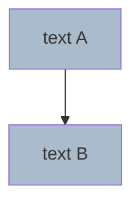

# Mermaid 渲染坑总结（生产用过的真实教训）

只在用户**明确要求"画图"时**才会写 mermaid。下面所有规则全部遵守，可避免 99% 的渲染失败。

## CDN 版本锁定

```html
<!-- ✅ 用 10.6.1，稳定无 inline-class bug -->
<script src="https://cdn.jsdelivr.net/npm/mermaid@10.6.1/dist/mermaid.min.js"></script>

<!-- ❌ 不要用 @10 或 @latest，会拉到 10.9.x，有 inline class apply 解析 bug -->
<script src="https://cdn.jsdelivr.net/npm/mermaid@10/dist/mermaid.min.js"></script>
```

## 节点 ID

| ❌ 不要用 | 原因 | ✅ 替代 |
|----------|------|--------|
| `END` | mermaid 关键字（终止状态） | `endn`、`end_node`、`stop` |
| `START` | mermaid 关键字 | `s0`、`startn` |
| `PM` / `END_NODE` | 大写 + 单词组合容易踩雷 | `pmn`、`endn` |
| 纯数字 `1`、`2` | 部分版本解析异常 | `n1`、`step1` |

**规则**：节点 ID 一律小写英文 + 数字，不用关键字、不用大写缩写。

## 节点文本

节点文本（方括号内的内容）里以下字符**严禁出现**：

| 字符 | 为什么炸 |
|------|---------|
| `::` (双冒号) | 被解析器误识别为 `:::className`（class apply）的起始 |
| `→` | unicode 箭头，10.9.x 解析时不稳定 |
| `×` | 同上 |
| `≥` `≤` `≠` | 同上 |
| `▶` `⬛` `👋` 等 emoji | 部分版本对 unicode emoji 处理出错 |
| `🟣` `🟢` `🔵` 等彩色圆点 emoji | 同上 |
| `(...)` 当作为节点 stadium 形状 `(["..."])` | 部分版本对 stadium 形状嵌套引号支持差 |

**替代方案**：
- `::` → `·`（中点）、`.`（句点）、`-`（连字符）
- `→` → `>`、`返回`、`/`
- `×` → `x`
- emoji → 直接去掉，用中文字"开始"、"结束"
- stadium `([...])` → 普通矩形 `[...]`

## Class 应用：必须用分离式，不要 inline

**inline 写法** 在 mermaid 10.9.x 上有 bug，即使语法正确也可能炸：



**分离式写法** 兼容性好得多：


**规则**：所有 class apply 都放到 mermaid 块**末尾**，用 `class id1,id2,id3 className;` 语法。

## 边标签

```mermaid
%% ✅ 用 -->|label| 形式
a1 -->|带 label 的边| a2

%% ✅ 用引号 + -- 文本 -->
a1 -- "标签内容" --> a2
```

边标签里的字符规则同节点文本：避免 `:`、`→`、emoji。

## classDef 末尾

每条 `classDef` 行末**加分号** `;`，部分版本严格要求：

```
classDef cli fill:#0e3a5b,stroke:#38bdf8,color:#e6edf7;
```

## HTML 容器

```html
<pre class="mermaid">
flowchart TD
    ...
</pre>

<script src="https://cdn.jsdelivr.net/npm/mermaid@10.6.1/dist/mermaid.min.js"></script>
<script>
  mermaid.initialize({
    startOnLoad: true,
    theme: 'dark',
    securityLevel: 'loose',
    flowchart: { curve: 'basis', useMaxWidth: true, htmlLabels: true }
  });
</script>
```

- 用 `<pre class="mermaid">` 包裹，**不要**用 `<div class="mermaid">`（少数浏览器吃换行不一致）
- `theme: 'dark'` 配深色背景页面好看
- `securityLevel: 'loose'` 允许 `<br/>` 在节点文本里换行（必需）

## 调试技巧

如果用户报 "Syntax error in text"：

1. 先看是哪个 mermaid 块炸（页面会指出大概位置）
2. 用 Python 抽出该 mermaid 块到 `/tmp/x.mmd`
3. 用 `npx -y @mermaid-js/mermaid-cli@10.6.1 -i /tmp/x.mmd -o /tmp/x.svg 2>/tmp/err.log` 跑
4. 看 `/tmp/err.log` 里的 parser 报错（行号 + token）
5. 按上面规则逐项排查

或者最快：**直接 grep 所有可疑字符**：

```bash
grep -nE ':: |→|×|⬛|▶|👋|🟣|🟢|🔵|≥|≤' your.html
```
