

# MeetMind 项目介绍

**数字分身会议协作系统 · AI Digital Avatars that Meet, Discuss & Summarize**

---

## 一、项目概述

**MeetMind** 是一套**多智能体（Multi-Agent）研发团队协作系统**。它用 5 个分工明确的 AI 智能体，模拟一支完整的研发团队，围绕用户提出的项目需求自动展开讨论、各自检索专业知识、协同给出综合方案。

简单来说：把一个产品想法或技术需求交给系统，几分钟内就能得到来自**架构、后端、前端、测试、产品**五个专业视角的讨论结论，作为方案评审、需求拆解、技术预研的智能辅助。

系统提供完整的图形界面，从登录、提问、多角色协作讨论到会话管理一气呵成：

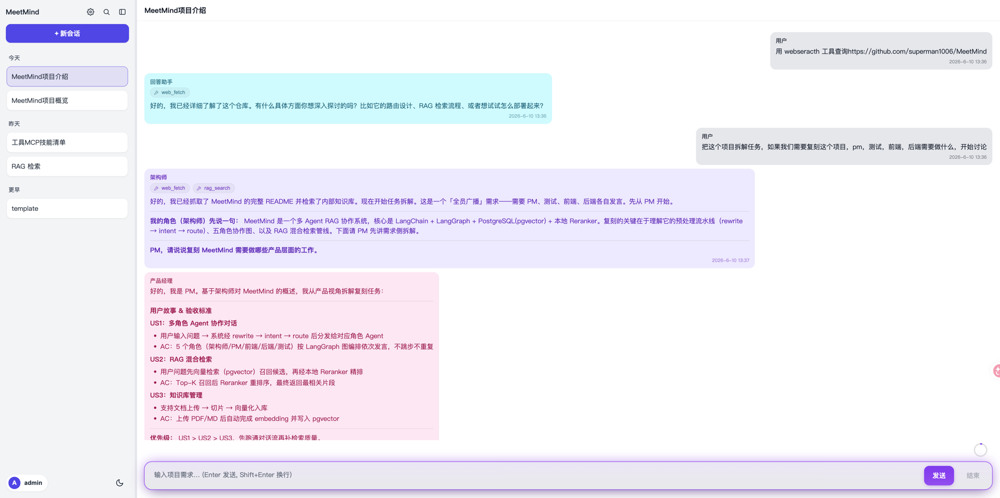

*主界面：左侧为会话列表，中间为多角色协作讨论。每个角色用不同颜色的气泡区分，讨论过程实时流式呈现。*

---

## 二、五个角色，一支团队

系统把一支真实研发团队的角色拆给 5 个 AI 智能体来扮演，每个角色都有自己的专业定位与独立知识库：

| 角色 | 职责定位 |
| --- | --- |
| **架构师 Architect** | 团队的入口与终结者，统筹全局、决定讨论的开始与结束 |
| **后端 Backend** | 负责服务端、数据、接口层面的方案 |
| **前端 Frontend** | 负责界面、交互、用户体验层面的方案 |
| **测试 Test** | 负责质量、用例、风险层面的把关 |
| **产品经理 PM** | 负责需求、优先级、业务价值层面的判断 |

架构师收到需求后，系统会根据讨论的实时内容**自动决定下一个该谁发言**，像真实会议一样多轮往返，直到架构师判断"讨论完成"为止——整个过程无需人工干预编排。

---

## 三、整体架构

系统采用**前后端分离**的工程结构（同一代码仓内含两端）：前端是面向用户的桌面 / Web 客户端（desktop），后端是承载全部智能体编排与检索的运行时服务（runtime），数据则统一落在一个 PostgreSQL 数据库中。下面从「请求如何进来、如何被处理、如何保证稳健」三个层面拆解整体设计。

### 1. 前后端通信：指令通道 + 实时推送双轨制

前端与后端之间用两条独立通道协作，各司其职：

- **指令通道（RPC）**——前端的每一个操作都对应一个明确的后端方法，由后端统一入口分发执行。例如：

  | 前端操作 | 对应后端方法 |
  | --- | --- |
  | 发送消息 / 打断 / 结束会议 | `chat.send` / `chat.interrupt` / `chat.end` |
  | 新建 / 重命名 / 删除会话、拉取历史 | `session.create` / `session.rename` / `session.delete` / `session.messages` |
  | 读取 / 保存模型配置 | `model.get` / `model.set` |

- **实时推送通道（SSE）**——客户端启动时与后端建立一条**长连接**用于接收实时消息。后端为每个客户端维护一个连接对象，智能体每吐出一段内容就向对应客户端推送一次，并携带会话标识（sessionId），前端据此把消息准确投递到对应会话。这正是讨论过程能够"逐字流式呈现"的底层支撑。

### 2. 每轮请求的处理流水线（改写 → 意图识别 → 路由）

用户每提一个问题，系统都会先经过一条**预处理流水线**，再决定走哪条路：

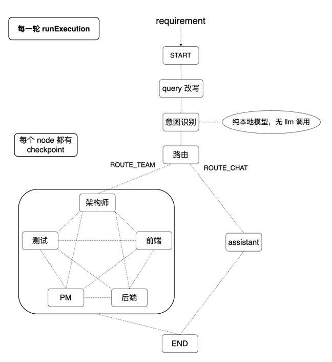

*运行流程：需求进入后先做查询改写与意图识别（纯本地模型，无额外大模型调用），再分流到「5 角色团队」或「单点助手」。每个环节都有断点（checkpoint），中断后可恢复。*

- **查询改写**——把口语化、带指代的提问改写成一句独立、完整的需求，便于后续理解与检索。
- **意图识别**——用一个**本地多语种语义理解模型**判断这句话的意图，归入「闲聊 / 知识问答 / 开发需求 / 任务指令」四类之一。整个判断在本地完成，**不调用大模型、零额外成本**。
- **智能路由**——按意图分流：闲聊、简单知识问答交给「单点智能助手」快速回答；开发需求、任务指令则唤起整个 5 人团队协作。

### 3. 智能体的标准构成与共享状态

每个角色智能体都是一个"标准件"，由六个部分组装而成，结构统一、便于横向扩展：

| 组成 | 说明 |
| --- | --- |
| 大模型（LLM） | 负责理解与生成 |
| 工具集（Tools） | 全体角色共享同一套工具，含本地工具与外部 MCP 工具 |
| RAG 检索器 | 检索本角色的私有知识库 |
| 种子资料 | 该角色的初始领域文档（Markdown / PDF / Word / JSON 等） |
| 专属数据表 | PostgreSQL 中一张 `meetmind_xx` 表，存放内容与向量 |
| 结构化输出 | 每次发言产出标准结果：发言内容、下一位发言者、是否完成、是否用过检索、工具调用明细等 |

所有角色还共享同一份**全局会话状态**（需求、历次发言记录、下一位发言者、是否完成、当前轮次），像一块团队公共白板，保证多角色协作时信息一致、上下文连贯。

### 4. 路由协议：四层兜底的结构化输出

"下一个该谁发言、讨论是否结束"是多智能体协作的关键。系统用**四层递进的约束**确保这个判断永远稳定可解析，绝不让流程卡死：

1. **提示词引导**——要求模型按指定 JSON 格式输出；
2. **结构化输出强约束**——在调用层面强制模型返回结构化结果；
3. **Schema 校验**——用预定义的数据结构（zod schema）校验字段是否合规；
4. **兜底函数**——万一前三层都异常，自动回退到默认值（下一位发言者设为架构师、讨论标记为未完成），保证图永远能继续往下走。

### 5. 断点快照：每个节点跑完都留一帧

讨论的每一个环节（改写、意图识别、各角色发言）跑完后，系统都会把当前的完整状态**快照保存进数据库**。一旦讨论中途崩溃或被人为打断，这些快照就是可恢复的依据——既可以从最近的断点续跑，也可以选择放弃，进度不丢失。

---

这套架构带来三个直接收益：

- **省成本**——意图识别、向量化、重排序等高频环节全部在本地完成，闲聊和简单问答不必惊动整个团队，也不产生额外的外部 API 费用；
- **更稳健**——每个节点都有断点快照，加上四层兜底的路由协议，讨论既不会"卡死"，崩溃后也能续跑；
- **可扩展**——智能体是统一构成的"标准件"、角色之间自由路由，增删角色或调整分工都不影响主流程。

---

## 四、核心能力详解

### 1. 检索增强（RAG）——让每句回答都有据可依

每个角色都有一份独立的**私有知识库**。回答前，智能体会先从自己领域的资料中做检索，把最相关的内容作为依据，避免凭空编造。

检索采用**双路并行 + 本地重排**：关键词召回与向量语义检索同时进行，合并去重后，再用本地重排序模型挑出最相关的若干条喂给大模型。

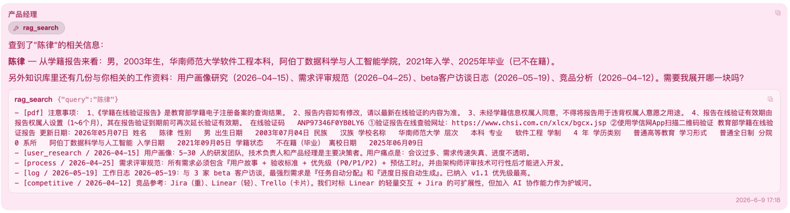

*智能体自主调用 `rag_search` 工具检索私有知识库，命中的资料会作为回答依据。*

底层用**一个 PostgreSQL 数据库**同时承担「文档存储 + 关键词检索 + 向量检索」三项能力，每个角色对应一张独立的数据表：

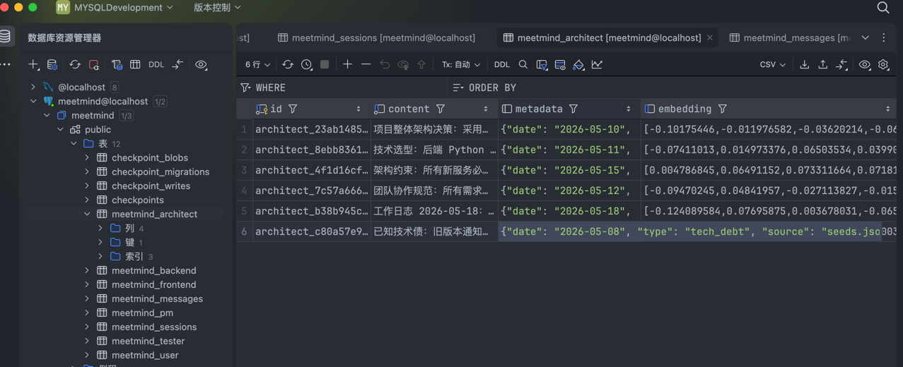

*每个角色一张表，统一结构（内容 + 元数据 + 向量），存储与检索一体化，无需额外的向量数据库。*

> 整条检索链路（向量化、关键词召回、语义重排）**全部在本地或自有数据库完成，不依赖任何外部付费检索 API，数据不出私域**。

### 2. 工具调用与人工审批

智能体不仅能检索知识库，还能像人一样调用一系列**工具**来完成任务，并由模型自主决定何时使用哪个工具。所有角色共享同一套工具，目前内置如下：

| 工具 | 功能 | 风险等级 |
| --- | --- | :---: |
| **rag_search** | 检索本角色的私有知识库（关键词 + 向量混合检索、本地重排），是 RAG 能力的入口 | 低 |
| **Read** | 读取指定文件的文本内容，按行号输出，支持大文件分段读取 | 低 |
| **list_dir** | 列出指定目录下的文件与子目录，并标注类型 | 低 |
| **glob** | 按通配符模式递归查找文件，返回匹配的文件路径列表 | 低 |
| **grep** | 在项目中按正则搜索文件内容，返回「文件 : 行号 : 正文」命中列表 | 低 |
| **list_processes** | 查看当前主机正在运行的进程，可按关键字过滤 | 低 |
| **echo** | 原样回显一段文本（轻量调试 / 占位用途） | 低 |
| **skill** | 加载并读取技能库（skills/）中的技能说明文档 | 低 |
| **web_fetch** | 抓取指定网址的网页正文，供查阅公网具体页面 / 文档 / 接口返回 | 中 |
| **Edit** | 对指定文件做精确的字符串替换式修改 | 中 |
| **Write** | 整体写入文件（不存在则新建、存在则覆盖） | 高 |
| **AIsearch**（外部 MCP） | 联网搜索（接入百度 AI Search），补充实时公网信息 | 外部 |

> 前 8 项为**只读 / 无副作用**工具，模型可直接调用；`web_fetch`、`Edit` 会向外发请求或改动文件，`Write` 会覆盖 / 新建文件，均带有副作用——这正是下面"人工审批"要管控的对象。`AIsearch` 由外部 MCP 服务注入，与具体角色无关，缺失配置时自动跳过、不影响启动。

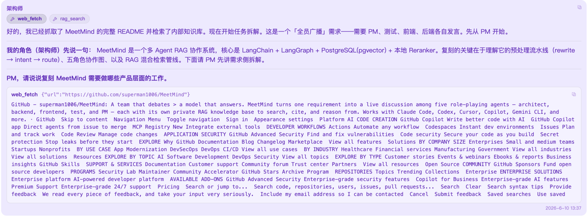

*智能体根据需要自主调用工具，过程透明可见。*

**风险分级 + 人工审批（Human-in-the-Loop）**：每个工具都标注了风险等级。**低风险工具自动执行**；**风险高于"低"的工具（中 / 高）在执行前必须先弹出审批条，由用户点击确认后才会真正执行**，拒绝则跳过不执行。这样既保留了智能体的自主能力，又把"写文件、抓取公网"等敏感动作牢牢握在用户手里，安全可控。

*高风险操作会弹出审批条，用户确认后才执行。*

### 3. 会话与历史管理

- **多会话管理**：新建、切换、重命名、删除会话，标题可自动总结生成。
- **历史全文搜索**：在所有历史会话中快速检索定位。

  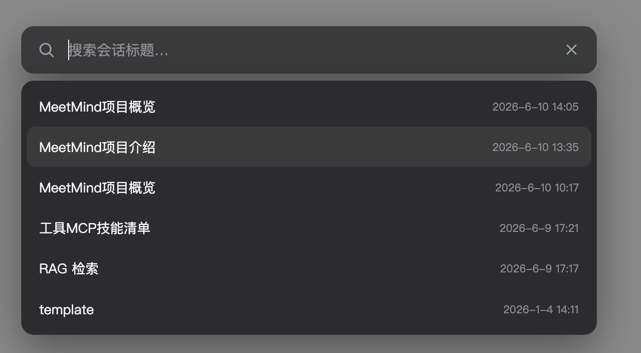

- **长对话自动压缩**：对话变长时自动把早期内容滚动总结成摘要，既保留上下文又控制成本。

  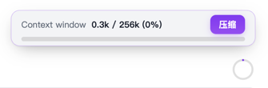

- **会议纪要导出**：一轮多角色讨论结束后，系统自动把整场讨论汇总成一份结构化纪要，并落盘为本地 Markdown 文件，方便归档、分享与二次编辑。

  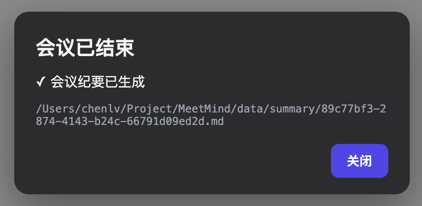

  *讨论结束弹窗：提示会议纪要已生成，并给出导出的纪要文件路径。*

### 4. 用户体系与个人记忆

系统提供完整的账号体系，会话按用户隔离，并能记住每位用户的偏好与背景。

<table>
<tr>
<td align="center">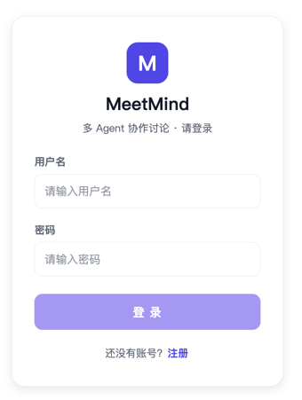 用户登录</td>
<td align="center">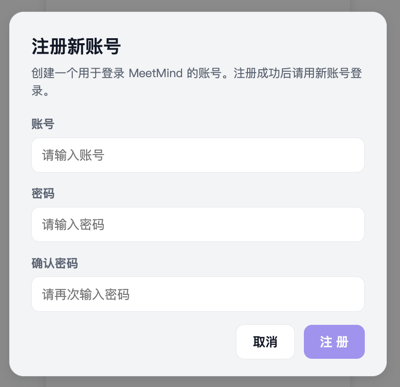 用户注册</td>
</tr>
</table>

- **个人记忆**：记住用户的身份、偏好与背景，自动融入每一次对话，让回答更贴合本人。

  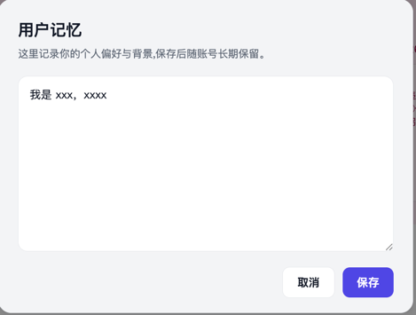

### 5. 稳定性与灵活性

- **断点续跑**：讨论中途崩溃或被中断后，可以从断点恢复继续，也可以选择放弃，进度不丢失。

  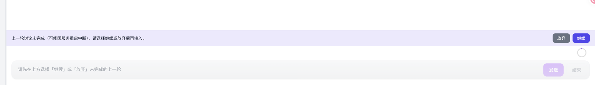

- **大模型热切换**：通过 OpenAI 兼容协议接入，**兼容市面上绝大多数大模型 API**（凡支持 OpenAI 兼容协议的模型服务均可对接），可在界面上即时切换到其他模型，**无需改代码、无需重启服务**。

  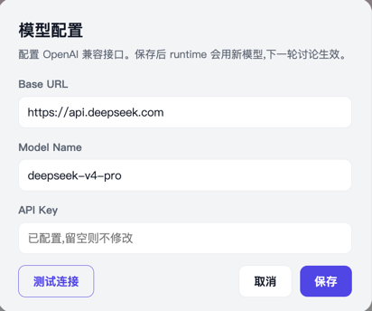

- **明暗主题切换**：界面支持深色 / 浅色主题，适配不同使用环境。

  <table>
  <tr>
  <td align="center"></td>
  <td align="center"></td>
  </tr>
  </table>

---

## 五、功能列表总览

| 分类 | 功能 |
| --- | --- |
| **智能体协作** | 5 角色 AI 团队自动协作、多轮自由路由；意图识别智能分流（问答走单点助手，需求走团队）；实时流式输出；单轮讨论自动收尾 |
| **检索增强 RAG** | 每角色独立私有知识库；关键词 + 向量双路混合检索；本地重排序；支持 JSON / PDF / Word / Markdown / 文本多格式资料导入；可选联网搜索 |
| **工具与安全** | 智能体自主工具调用；高风险操作人工审批（HITL）；账号登录注册；会话按用户隔离 |
| **会话管理** | 多会话新建 / 切换 / 重命名 / 删除；标题自动总结；历史全文搜索；长对话自动压缩；会议纪要生成 |
| **个性化** | 用户个人记忆；明暗主题切换 |
| **稳定运维** | 断点续跑；大模型热切换；桌面客户端 + Web 双形态 |

---

## 六、最终产物

### 1. 一套可运行的完整系统

| 产物 | 说明 |
| --- | --- |
| **后端服务（runtime）** | 智能体编排 + RAG 检索 + 数据持久化的核心服务，对外提供 HTTP / 实时推送接口 |
| **桌面 / Web 客户端（desktop）** | 面向用户的图形界面：登录、聊天、会话管理、模型设置、审批交互等 |
| **本地数据库（PostgreSQL + pgvector）** | 一个数据库同时承担文档存储、关键词检索、向量检索，一键 Docker 启动 |

### 2. 配套资产

- **种子知识库**：5 个角色各自的初始领域资料，开箱即用
- **本地 AI 模型**：向量化模型 + 重排序模型（首次启动自动下载，之后完全离线运行，无需 GPU）
- **完整文档**：中英文 README、架构说明、调用链分析文档
- **部署配置**：Docker Compose 一键起库，支持私有化部署

### 3. 技术栈

| 维度 | 选型 |
| --- | --- |
| 语言 / 形态 | TypeScript（Monorepo，前后端同仓） |
| 智能体编排 | LangChain + LangGraph |
| 存储与检索 | PostgreSQL + pgvector（向量）+ pg_trgm（关键词） |
| 本地 AI 能力 | Transformers.js（向量化 + 重排序，纯本地推理） |
| 大模型接入 | OpenAI 兼容协议（默认小米 MiMo，可热切换） |
| 前端 | Vue + Vite（支持 Tauri 桌面外壳） |

---

**项目定位**

一套可私有化部署、低运行成本、可灵活替换大模型的 
**多智能体协作 + 检索增强**系统， 
可作为团队方案评审、需求预研、知识问答的智能辅助工具， 
也是多 Agent / RAG 技术能力的完整落地样板。

